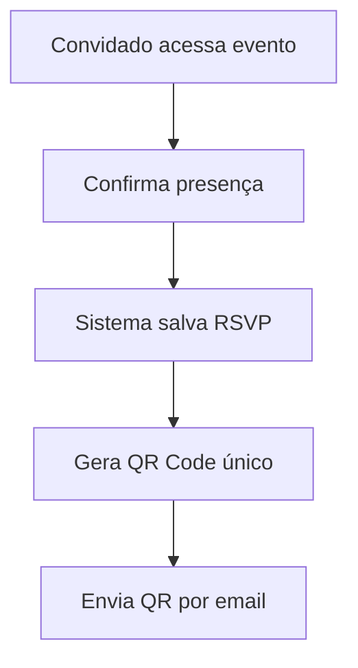
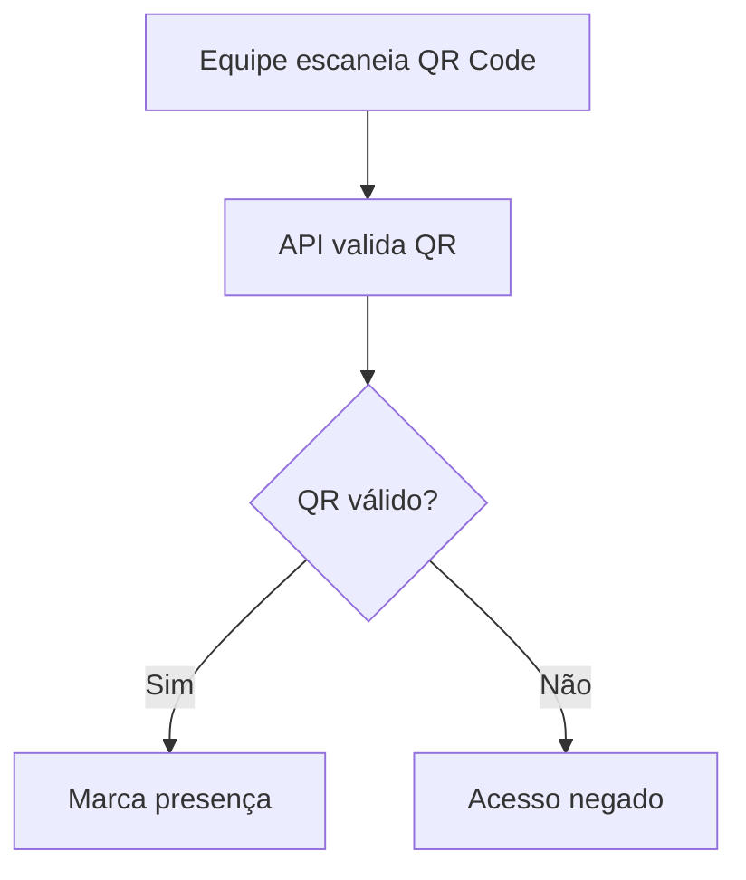
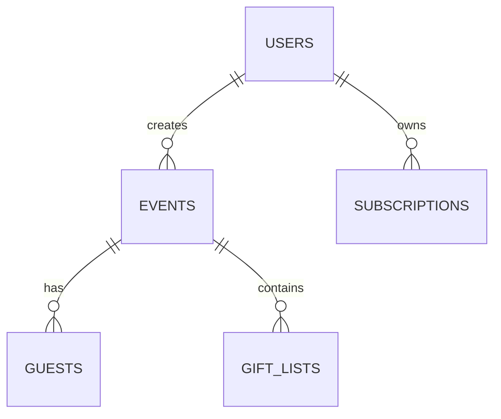
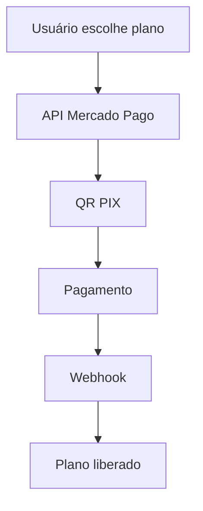

# 🚀 OMNIX — Plataforma SaaS de Convites Digitais e Gestão de Eventos

> "Born from what should have ended."

O **OMNIX** é uma plataforma SaaS (Software as a Service) voltada para criação, gerenciamento e controle inteligente de eventos digitais.

A proposta do sistema é centralizar recursos modernos de organização de eventos em uma única plataforma, permitindo que usuários criem convites digitais personalizados, controlem convidados, realizem confirmação de presença (RSVP), utilizem QR Codes para check-in e compartilhem eventos online.

---

# 📌 Funcionalidades

## 👤 Usuário
- Cadastro de usuários
- Login com JWT
- Recuperação de senha
- Gerenciamento de perfil
- Controle de planos

---

## 📅 Eventos
- Criação de eventos
- Edição de eventos
- Exclusão de eventos
- Definição de:
  - Nome
  - Data
  - Horário
  - Localização
  - Mensagem personalizada
  - Tipo do evento
  - Banner
  - Plano ativo

---

## 🌐 Página Pública do Evento
Cada evento terá:
- URL exclusiva
- Layout personalizado
- Nome do evento
- Mensagem personalizada
- Data e horário
- Localização no mapa
- Lista de presentes
- RSVP online
- QR Code de entrada

### Exemplo
```bash
https://omnix.app/evento/casamento-joao-e-maria
```

---

# ✅ Sistema RSVP (Confirmação de Presença)

O RSVP permite que convidados confirmem presença antes do evento.

## Fluxo RSVP

1. Usuário cria evento
2. Convida pessoas
3. Sistema gera link público
4. Convidado acessa
5. Convidado confirma presença
6. Sistema registra confirmação
7. QR Code único é gerado automaticamente

---

# 📲 Sistema Inteligente de Presença

## Funcionamento

Cada convidado recebe um QR Code único.

No dia do evento:

- Equipe escaneia QR Code
- Sistema valida o convidado
- Presença é marcada em tempo real
- Evita duplicidade
- Mostra horário do check-in

---

# 🔥 Tipos de Presença

## 1. Presença Antecipada
Quando o convidado confirma pelo RSVP.

```text
Status: CONFIRMADO
```

---

## 2. Presença Real no Evento
Quando o QR Code é escaneado na entrada.

```text
Status: CHECK-IN REALIZADO
```

---

# 🎟️ Fluxo do QR Code

## Geração

O sistema gera:

```text
UUID + ID DO EVENTO + HASH
```

### Exemplo

```text
OMNIX-4f8a91d2-event-10
```

---

## Processo RSVP



---

## Entrada no Evento



---

# 💳 Planos do Sistema

## 🔹 OMNIX BASIC
- Página simples do evento
- Link compartilhável

---

## 🔹 OMNIX CLASSIC
- Página personalizada
- RSVP online
- Layouts premium

---

## 🔹 OMNIX BLACK
- Tudo do CLASSIC
- Sistema de QR Code
- Controle de presença
- Dashboard avançado

---

# 🛠️ Tecnologias

## Backend
- Java 17
- Spring Boot
- Spring Security
- JWT
- JPA / Hibernate

---

## Frontend
- Angular 
- TypeScript
- Angular Material

---

## Banco de Dados
- PostgreSQL

---

## Infraestrutura
- Railway (Backend + DB)
- Vercel (Frontend)

---

## Integrações
- Mercado Pago (PIX)
- QR Code Generator
- Email SMTP
- Google Maps API

---

# 🧠 Arquitetura do Sistema

```text
Frontend Angular
       ↓
API REST Spring Boot
       ↓
PostgreSQL
       ↓
Integrações externas
(Pix, Email, QR Code)
```

---

# 📂 Estrutura do Projeto

```bash
omnix/
│
├── backend/
│   ├── src/
│   ├── controllers/
│   ├── services/
│   ├── repositories/
│   ├── entities/
│   ├── security/
│   └── config/
│   └── dto/
│   └── exceptions/
│   └── utils/
│   └── enums/
│
├── frontend/
│   ├── src/
│   ├── app/
│   ├── pages/
│   ├── components/
│   └── services/
│
└── database/
    └── scripts/
```

---

# 🗄️ Modelagem de Dados

# 👤 Tabela: users

| Campo | Tipo |
|---|---|
| id | BIGINT |
| name | VARCHAR |
| email | VARCHAR |
| password | VARCHAR |
| plan | ENUM |
| created_at | TIMESTAMP |

---

# 📅 Tabela: events

| Campo | Tipo |
|---|---|
| id | BIGINT |
| user_id | BIGINT |
| title | VARCHAR |
| slug | VARCHAR |
| description | TEXT |
| event_date | DATE |
| event_time | TIME |
| address | VARCHAR |
| banner_url | VARCHAR |
| type | VARCHAR |
| created_at | TIMESTAMP |

---

# 👥 Tabela: guests

| Campo | Tipo |
|---|---|
| id | BIGINT |
| event_id | BIGINT |
| name | VARCHAR |
| email | VARCHAR |
| phone | VARCHAR |
| qr_code | TEXT |
| rsvp_status | ENUM |
| checked_in | BOOLEAN |
| checked_in_at | TIMESTAMP |

---

# 🎁 Tabela: gift_lists

| Campo | Tipo |
|---|---|
| id | BIGINT |
| event_id | BIGINT |
| title | VARCHAR |
| link | VARCHAR |

---

# 💳 Tabela: subscriptions

| Campo | Tipo |
|---|---|
| id | BIGINT |
| user_id | BIGINT |
| plan | ENUM |
| status | ENUM |
| mercado_pago_id | VARCHAR |
| created_at | TIMESTAMP |

---

# 🔗 Relacionamentos



---

# 🔐 Segurança

## Autenticação
- JWT Token
- Spring Security

## Proteções
- BCrypt Password
- Rate Limiting
- CORS
- Validação de QR Code

---

# 📡 API REST

# 🔑 Auth

## Login

```http
POST /api/auth/login
```

### Request

```json
{
  "email": "admin@omnix.com",
  "password": "123456"
}
```

### Response

```json
{
  "token": "JWT_TOKEN"
}
```

---

# 👤 Usuário

## Criar usuário

```http
POST /api/users
```

---

# 📅 Eventos

## Criar evento

```http
POST /api/events
```

### Request

```json
{
  "title": "Casamento João e Maria",
  "eventDate": "2026-12-20",
  "eventTime": "19:00",
  "address": "Natal/RN"
}
```

---

## Listar eventos

```http
GET /api/events
```

---

## Buscar evento público

```http
GET /api/public/events/{slug}
```

---

# ✅ RSVP

## Confirmar presença

```http
POST /api/rsvp
```

### Request

```json
{
  "eventId": 1,
  "guestName": "Carlos",
  "email": "carlos@email.com"
}
```

---

# 📲 QR CODE

## Validar QR Code

```http
POST /api/checkin
```

### Request

```json
{
  "qrCode": "OMNIX-4f8a91d2-event-10"
}
```

### Response

```json
{
  "status": "VALID",
  "guest": "Carlos",
  "checkedIn": true,
  "time": "19:02"
}
```

---

# 💳 Pagamentos PIX

## Mercado Pago

### Fluxo



---

# 📧 Sistema de Emails

## Emails automáticos

- Confirmação de RSVP
- QR Code
- Convite
- Recuperação de senha
- Pagamento aprovado

---

# 📍 Integração com Mapas

## Recursos
- Exibição do local
- Botão "Como chegar"
- Google Maps Embed

---

# 🧪 MVP Inicial

## Primeira versão do OMNIX

### Backend
- [x] Auth JWT
- [x] CRUD Usuário
- [x] CRUD Evento
- [x] RSVP
- [x] QR Code
- [x] Check-in

### Frontend
- [x] Landing page
- [x] Login
- [x] Dashboard
- [x] Página pública
- [x] Tela check-in

---

# 🚀 Futuras Funcionalidades

- Aplicativo Mobile
- IA para criar convites
- Templates premium
- Dashboard analytics
- Multi-idioma
- Integração WhatsApp
- Convites animados

---

# 📈 Escalabilidade

## Estratégias futuras

- Docker
- Kubernetes
- Redis Cache
- CDN
- Microservices

---

# 🧠 Regras de Negócio

## RSVP
- Um convidado não pode confirmar duas vezes

## QR Code
- QR é único por convidado

## Check-in
- Não permitir check-in duplicado

## Planos
- Recursos liberados conforme assinatura

---

# 🔥 Diferenciais do OMNIX

✅ Convites digitais modernos  
✅ Sistema inteligente de presença  
✅ RSVP online  
✅ QR Code exclusivo  
✅ Plataforma SaaS escalável  
✅ Integração PIX  
✅ Dashboard profissional  

---

# 👨‍💻 Desenvolvedor José Jonadabe S. Barros

[](https://www.instagram.com/jonadabedev?igsh=NGo0ejlqczNmMTVn)
[](https://www.linkedin.com/in/josé-jonadabe-s-barros-2395043b7?utm_source=share_via&utm_content=profile&utm_medium=member_android)

## OMNIX
Uma evolução da organização de eventos digitais.

```text
Born from what should have ended.
```

---
